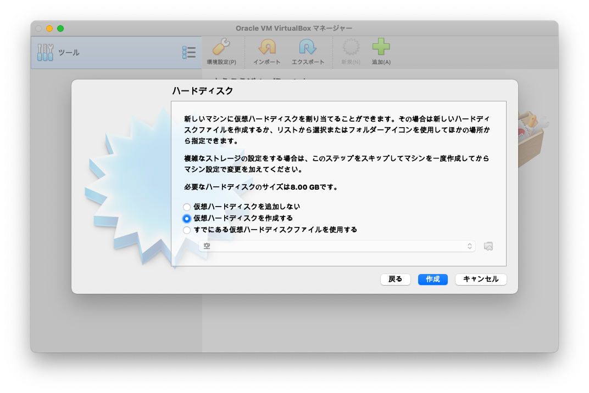
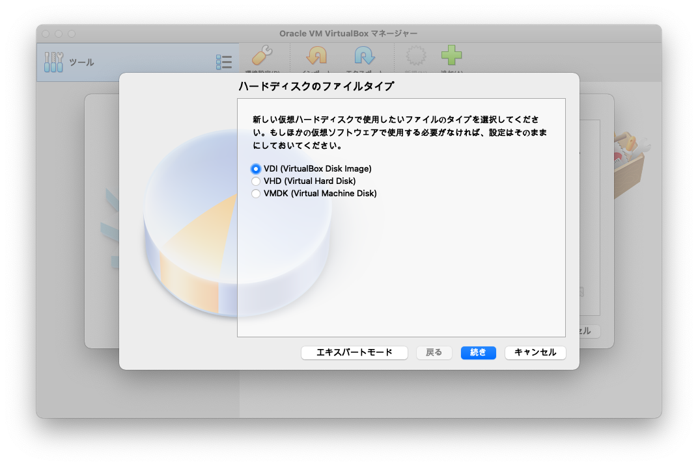
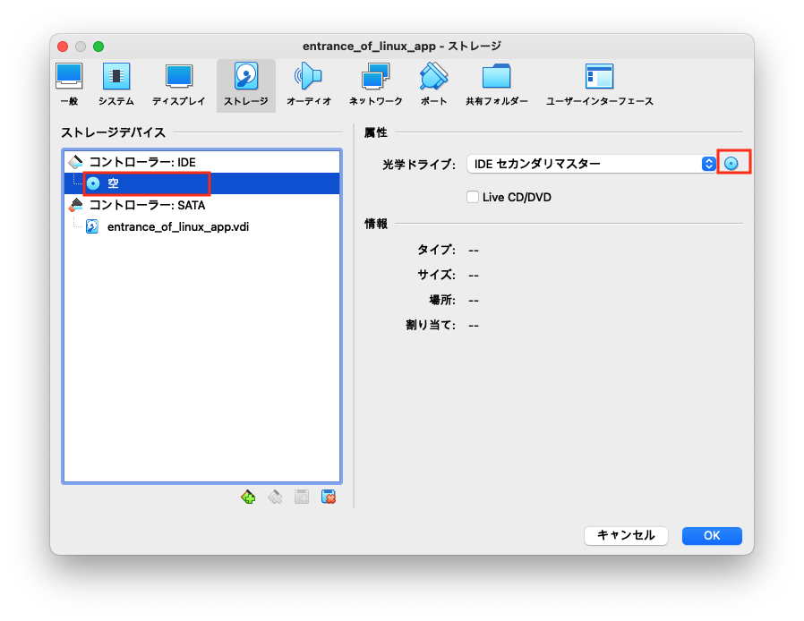
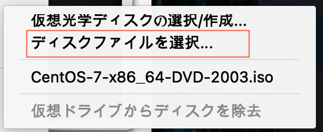
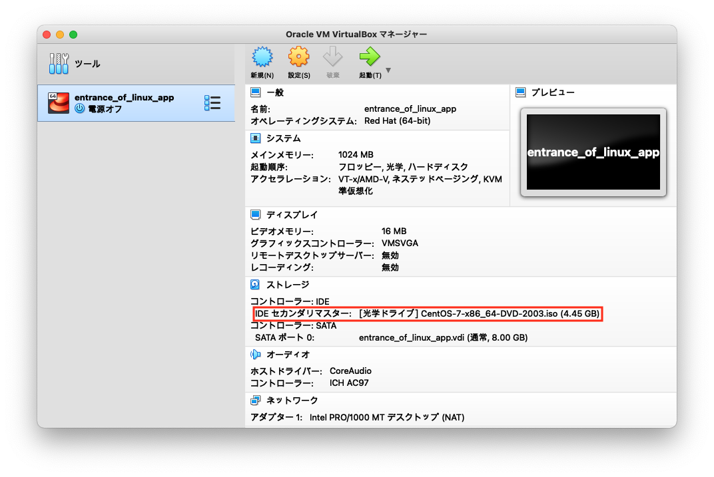
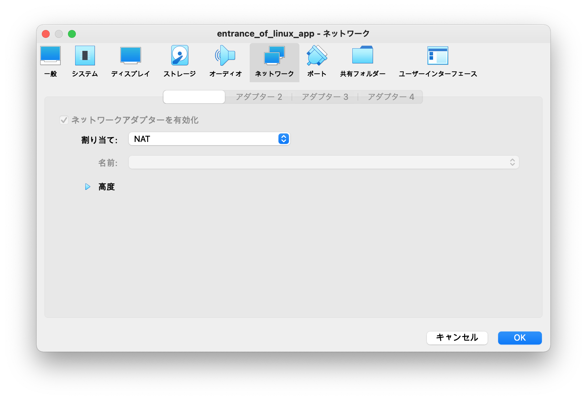
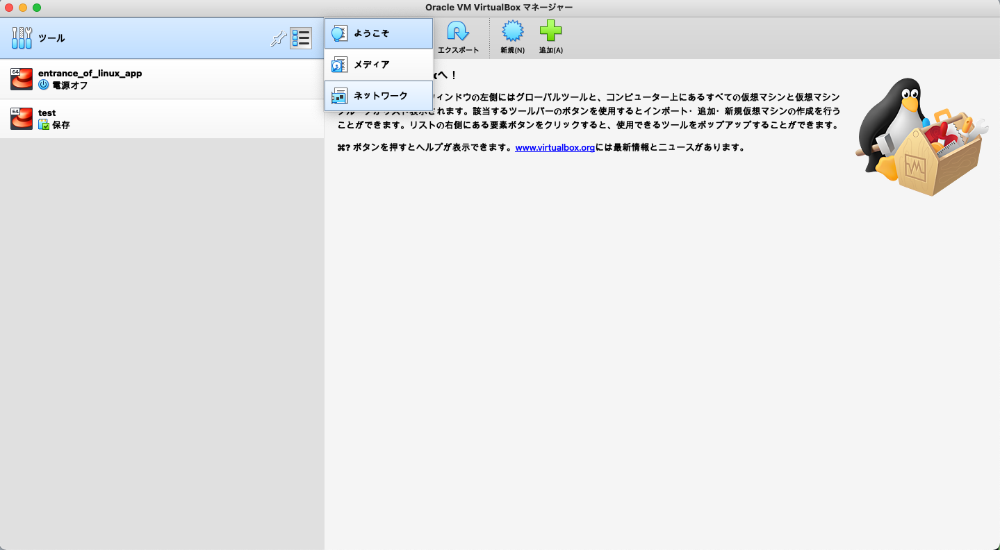
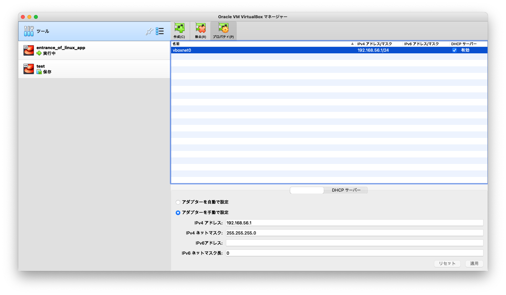
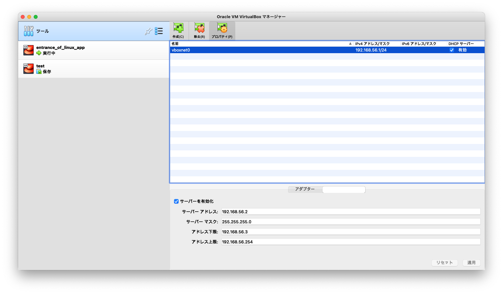

# ゲストOSのインストール
## VirtualBoxの設定
### ハードディスクの設定
#### ハードディスク


|項目|概要|備考|
|:--|:--|:--|
|仮想ハードディスクを追加しない|ローカル環境に仮想ハードディスクの領域を追加しない|別途設定を行う必要がある|
|仮想ハードディスクを作成する|ローカル環境に仮想ハードディスクの領域を新規追加||
|すでにある仮想ハードディスクファイルを使用する|既存の仮想ハードディスクの領域を使用||

#### ハードディスクのタイプ

- 仮想ハードディスクの互換性の違い

|項目|概要|備考|
|:--|:--|:--|
|VDI(VirtualBox Disk Image)|VirtualBox専用||
|VHD(Virtual Hard Disk)|Virtual PCと互換性がある||
|VMDK(Virtual Machine Disk)|VMWareと互換性がある||

### OS用ディスクイメージの読み込み
#### ディスクイメージの選択




### ネットワークの設定
#### ネットワークの割り当て


|項目|概要|概要|備考|
|:--|:--|:--|:--|
|NAT|Network Address Translation|パケットヘッダに含まれるIPアドレスを別のIPアドレスに変換する||
|ブリッジアダプター||||
|内部ネットワーク||VirtualBox間のみでアクセスを許可する||
|ホストオンリーアダプター||ホストからのアクセスのみ許可する||
|汎用ドライバー||||
|NATネットワーク||||
|Cloud Network||||
|未割り当て||||

#### ネットワークアダプタの作成




## OSのインストール
### ソフトウェアの選択
- ベース環境を確認する
```
$ yum groups list
```
- インストールされるパッケージを確認する
```
$ yum groups info <ベース環境>
```

## ユーザの設定
#### rootユーザ
- パスワード: `#eDcVfR4`

#### 一般ユーザ
- フルネーム：適当
- ユーザ名：`testuser`
- パスワード：`3EdCvFr$`
