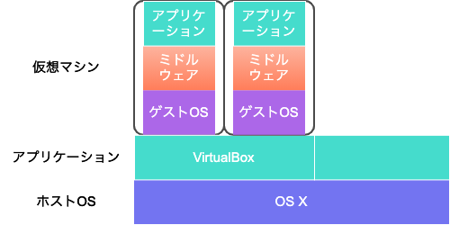
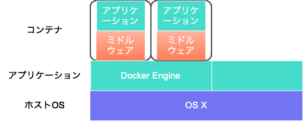

# VirtualBoxについて
## そもそもVirtualBoxとは？
- 仮想化ソフトウェアの一つ
   - 類似のものに以下がある
      - [VMWare](https://www.vmware.com/jp.html)
      - [Parallels](https://www.parallels.com/jp/)
- 現在、米Oracleが開発を行っている

### そもそも仮想化ソフトウェアとは？
- 手元のOS(`ホストOS`)上に、アプリケーションとして仮想化ソフトウェアをインストールし、
- そのアプリケーション上にて、追加のOS(`ゲストOS`)を実行することができる

   

### Dockerとの違い
- VirtualBoxやVMWare等は、アプリケーション上で仮想的なOSを作り出すのに対して
- Docker等は、アプリケーション上でゲストOSなしで、アプリケーションを実行する

   

# インストール
## する前に
- ターミナルアプリケーションを開き、以下のコマンドを実行する
```
ifconfig > ifconfig_before_install.txt
```
- [参考](用語集#ifconfig)

## インストールする
### 注意
- ホストOSの再起動を行うので注意してください。

## した後に
- ターミナルアプリケーションを開き、以下のコマンドを実行する
```
ifconfig > ifconfig_after_install.txt
```
- 事前に取得したものと比較してみる
```
diff ifconfig_before_install.txt ifconfig_after_install.txt
```
- 結果
```
```

# コマンド紹介
## ifconfig
### 概要
- ネットワーク環境の確認・設定を行う

### 表示内容
#### ネットワークインターフェース： `lo`
```
lo0: flags=8049<UP,LOOPBACK,RUNNING,MULTICAST> mtu 16384
        options=1203<RXCSUM,TXCSUM,TXSTATUS,SW_TIMESTAMP>
        inet 127.0.0.1 netmask 0xff000000 
        inet6 ::1 prefixlen 128 
        inet6 fe80::1%lo0 prefixlen 64 scopeid 0x1 
        nd6 options=201<PERFORMNUD,DAD>
```

#### ネットワークインターフェース： `eth0`
```
en0: flags=8863<UP,BROADCAST,SMART,RUNNING,SIMPLEX,MULTICAST> mtu 1500
        options=400<CHANNEL_IO>
        ether a4:83:e7:46:33:4b 
        inet6 fe80::14bf:4aaa:1a47:7137%en0 prefixlen 64 secured scopeid 0x6 
        inet6 2405:6582:560:2600:474:d68c:7cdf:981d prefixlen 64 
        inet 192.168.96.104 netmask 0xffffff00 broadcast 192.168.96.255
        nd6 options=201<PERFORMNUD,DAD>
        media: autoselect
        status: active
```
